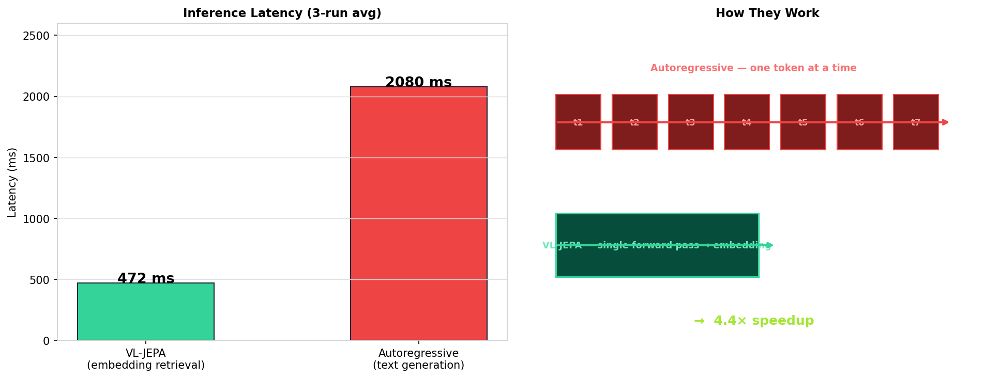
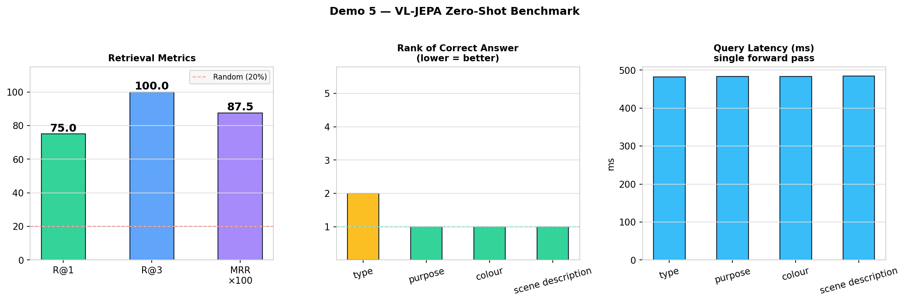

# VL-JEPA-Style Vision-Language Demo
## Embedding-Space Prediction for Real-Time Vision-Language Reasoning

A **portfolio implementation inspired by Meta FAIR’s VL-JEPA**.  
This project explores a simple but important idea:

> **predict semantic meaning in embedding space instead of generating answer tokens one-by-one.**

The original VL-JEPA paper proposes a non-generative vision-language architecture that predicts **continuous target embeddings** rather than text tokens. This repository does **not** reproduce Meta’s exact training stack. Instead, it builds a **VL-JEPA-style  implementation** with an open backbone so the architecture, loss design, and inference behavior can be studied end-to-end.

---

---

## What VL-JEPA is

VL-JEPA stands for **Vision-Language Joint Embedding Predictive Architecture**.

In the paper, the model has four parts:

1. **X-Encoder**  
   Encodes image or video into visual embeddings.

2. **Predictor**  
   Takes visual embeddings plus a text query and predicts the embedding of the answer.

3. **Y-Encoder**  
   Encodes the target answer text into a semantic embedding.

4. **Y-Decoder**  
   Converts a predicted embedding back into readable text when needed.

The key architectural shift is that training happens in **embedding space**, not token space.

---

## What this repository implements

This notebook implements the **core VL-JEPA pattern**:

- frozen visual encoder
- predictor conditioned on visual features + query text
- target text encoder
- shared projection space
- **bi-directional InfoNCE** training
- nearest-neighbor semantic retrieval
- optional text generation as a readout step

### What is replicated
- embedding-space prediction objective
- predictor / Y-encoder joint training
- shared semantic projection space
- bi-directional contrastive alignment
- separation between semantic prediction and text decoding

### What is substituted
The paper uses:
- **V-JEPA 2 ViT-L** for visual encoding
- **last 8 layers of Llama-3.2-1B** for the predictor
- **EmbeddingGemma-300M** for the Y-Encoder

This portfolio version uses **SmolVLM-Instruct-derived components** as an open, runnable substitute.

---

## Why VL-JEPA is Important

- **Semantic prediction over token generation:** predicts answer meaning in embedding space instead of forcing one exact token sequence.
- **Less sensitive to phrasing:** multiple valid answers can map to nearby embeddings rather than separate surface-form targets.
- **Better fit for retrieval-style tasks:** naturally supports ranking, matching, and discriminative VQA.
- **More efficient inference:** can stay in embedding space and decode to text only when readable output is needed.
- **Stronger for real-time systems:** reduces reliance on sequential token-by-token generation in perception-heavy settings.
- **Cleaner perception-generation split:** separates semantic understanding from language realization.
- **Well suited for video and robotics:** useful where fast state understanding matters more than verbose output.
- **Promising multimodal direction:** shifts VLM design toward semantically grounded, latency-aware reasoning.
---

## Results in this notebook

- **Semantic retrieval and reasoning:** shows embedding-space ranking across candidate answers.
- **Latency comparison:** contrasts one-shot semantic prediction with autoregressive generation.
- **Small benchmark:** reports lightweight retrieval metrics such as R@1, R@3, and MRR.
- **Optional comparison:** includes a limited zero-shot comparison with Qwen3-VL-Embedding-2B; this is illustrative only, not a paper-level evaluation.

---

## Real-world applications

### 1. Real-time assistive vision
Wearables and edge devices can use semantic prediction to monitor scenes continuously, decoding language only when a user-facing explanation is needed.

### 2. Robotics and embodied AI
Compact semantic representations can support downstream perception, state understanding, and decision-making in embodied systems.

### 3. Retrieval-first systems
In search, monitoring, and review workflows, ranking relevant answers by meaning is often more useful than generating long text.

### 4. Video understanding pipelines
Selective decoding is useful when semantic state changes are sparse relative to raw frame arrival rate.

### 5. High-stakes domains
In medical, industrial, and safety settings, discriminative retrieval and structured evidence matching can be more appropriate than unconstrained generation.
---

## References

- Chen et al. — **VL-JEPA: Joint Embedding Predictive Architecture for Vision-language**  
- Assran et al. — **V-JEPA 2: Self-Supervised Video Models Enable Understanding, Prediction and Planning**
- Assran et al. — **I-JEPA: Self-Supervised Learning from Images with a Joint-Embedding Predictive Architecture**
- LeCun — **A Path Towards Autonomous Machine Intelligence**

---

**Pankaj Somkuwar** - AI Engineer / AI Product Manager / AI Solutions Architect

- LinkedIn: [Pankaj Somkuwar](https://www.linkedin.com/in/pankaj-somkuwar/)
- GitHub: [@Pankaj-Leo](https://github.com/Pankaj-Leo)
- Website: [Pankaj Somkuwar](https://www.pankajsomkuwarai.com)
- Email: [pankaj.som1610@gmail.com](mailto:pankaj.som1610@gmail.com)
